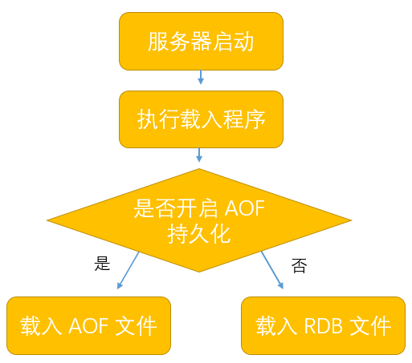
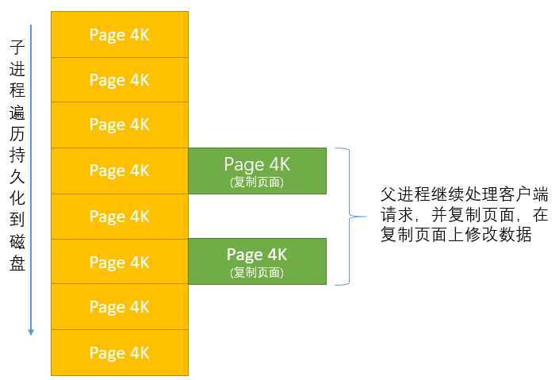

### 生成 RDB 文件的 Redis 命令

- SAVE 命令，由 Redis 主线程执行保存，因为 Redis 是单线程，所以会阻塞 Redis 其它工作，直到 RDB 文件创建完；
- BGSAVE 命令，Redis 主线程派生（fork）一个子线程，由它来创建 RDB 文件，不阻塞主线程。

　　服务器启动时，会自动载入 RDB 文件，这期间处于阻塞状态。但如果服务器开启了 AOF 持久化功能，会优先使用 AOF 来还原数据库状态。

### 命令参数

- save 900 1，服务器在 900 秒之内，对数据库进行至少一次修改，则执行 BGSAVE 命令；
- save 300 10，服务器在 300 秒之内，对数据库进行至少十次修改，则执行 BGSAVE 命令。

### 快照原理
　　Redis 使用操作系统的多线程 **COW（Copy On Write）机制实现快照持久化，COW 即当遇到修改时，复制一份，在复制的那份上修改。** 保证即使 fork 一个子线程，内存也不会增大到两倍。

- 调用 glibc 函数 fork 派生一个子线程，进行 RDB 持久化。刚开始时，子线程和父线程的共享内存的数据，所以可看到内存没有两倍增长；
- 子线程线程 RDB 持久化时，是对数据结构进行遍历读取，持久化到磁盘中；
- 在 RDB 持久化过程中，父线程继续处理客户端请求，对数据进行修改。数据有多个页面组成，每页大小为 4K。当父线程修改数据后，会对要修改的页面进行复制，在复制页面进行修改，而子线程则在原来的页面进行遍历持久化。