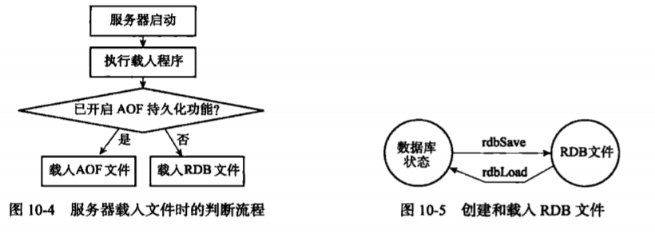
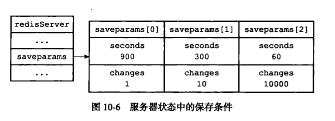
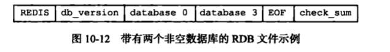
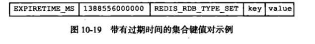
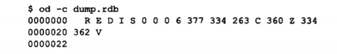
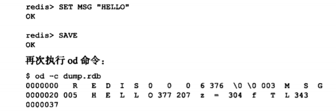

## RDB 持久化
　　Redis 是一个键值对数据库服务器，服务器中通常包含着任意个非空数据库，而每个非空数据库中又可以包含任意个键值对，为了方便，这里将服务器中的非空数据库以及他们的键值对统称为数据库状态。<br />
　　Redis 的数据是放在内存中，当遇到宕机重启时，数据会丢失。**RDB 持久化会生成一个压缩的二进制文件 RDB 文件，** 将数据持久化到磁盘，避免丢失。

### RDB 文件的创建与载入
　　生成 RDB 文件的 Redis 命令：

- SAVE 命令由服务器主进程执行保存工作，所以会阻塞 Redis 服务器进程，直到 RDB 文件创建完为止，即阻塞期间，服务器不能处理任何请求；
- BGSAVE 命令会派生一个子进程，由子进程来创建 RDB 文件，服务器进程（父进程）继续处理命令请求。在 BGSVAE 命令执行期间，客户端发送的 SAVE 命令会被服务器禁止，避免父进程（服务器进程）和子进程同时执行两个 rdbSave 调用，防止产生竞争条件，同理两个 BGSAVE 命令也被禁止。

　　RDB 文件的载入是**在服务器启动时自动执行的，没有专门的载入 RDB 文件命令。** 在载入期间，会一直处于阻塞状态，直到载入工作完成。另外一点，AOF 文件的更新频率通常比 RDB 文件的更新频率高，所以：
  
- 如果服务器开启了 AOF 持久化功能，**服务器会优先使用 AOF 文件来还原数据库状态**；
- 只有在 AOF 持久化功能处于关闭时，服务器才会使用 RDB 文件来还原数据库状态。



### 自动间隔性保存
　　通过指定配置文件或传入启动参数的方式设置 save 选项，没设置，则使用默认选项：
  
- save 900 1，服务器在 900 秒之内，对数据库进行至少一次修改，则执行 BGSAVE 命令；
- save 300 10，服务器在 300 秒之内，对数据库进行至少十次修改，则执行 BGSAVE 命令；
- save 60 10000，服务器在 60 秒之内，对数据库进行至少一万次修改，则执行 BGSAVE 命令；

　　服务器根据 save 选项所设置的保存条件，设置服务器状态 redisServer 结构的 saveparams 属性，该属性是一个数组，数组中的每个元素都是一个 saveparam 结构，每个 saveparam 结构保存一个 save 选项设置的保存条件。Redis 的服务器周期性操作函数 serverCron 默认每隔 100 毫秒会遍历检查 saveparams 数组中的所有保存条件，只要有一个条件满足，就执行 BGSAVE 命令：
  
```c
struct savparam {
    // 秒数
    time_t seconds;
    // 修改数
    int changes;
}
```



#### dirty 计数器和 lastsave 属性
　　除了 saveparams 数组外，服务器状态还维持着一个 dirty 计数器，以及一个 lastsave 属性：
  
- dirty 计数器，记录距离上一次成功执行 save 命令或 BGSAVE 命令后，服务器对数据库状态（服务器中的所有数据库）进行了多少次修改（包括写入、删除、更新等操作）；
- lastsave 属性是一个 UNIX 时间戳，记录上一次成功执行 SAVE 命令或 BGSAVE 命令的时间；

### RDB 文件结构
　　一个完整的 RDB 文件包含 REDIS、db_version、database、EOF、check_sum 等部分。

- RDB 文件的最开头是 REDIS 部分，长度为 5 字节，保存着 "REDIS" 五个字符，用于在载入文件时，检查是否为 RDB 文件。不是，则跳过不解析后面的内容，可理解为自定义协议的魔数。注意，因为 RDB 文件保存的是二进制数据，而不是 C 字符串，所以不带 "\0" 结尾符号；
- db_version，长度为 4 字节，为整数字符串，记录了 RDB 文件的版本号，比如 "0006" 代表了 RDB 文件的版本为第六版；
- database 部分包含着零个或任意多个数据库，以及各个数据库中的键值对数据。如果服务器的所有数据库都为空，则 database 为空，长度为 0 字节。如果服务器至少有一个数据库非空，则长度根据数据库保存的键值对数量、类型和长度不同而不同；
- EOF 常量的长度为 1 字节，标志着 RDB 文件正文内容结束，即所有数据库的所有键值对已载入；
- check_sum 是一个 8 字节长的无符号整数，保存着一个校验和，通过对 REDIS、db_version、database、EOF 四个部分的内容计算得出的，用于在载入 RDB 文件时，计算载入数据的校验和与 check_num 所记录的校验和是否一致，来检查 RDB 文件是否出错或损坏。

#### database 部分
　　一个 RDB 文件的 database 部分可以保存任意多个非空数据库。如下，有两个数据库非空，0 号数据库和 3 号数据库，每个数据库包含各自所有的键值对数据：
  


　　每个非空数据库包含三个部分 SELECTDB、db_number、key_value_pairs。
  
- SELECTDB，为常量，长度为 1 字节，表示要读入的将是一个数据库号码；
- db_number，保存着一个数据库号码，根据号码的大小不同，长度可为 1 字节、2 字节或 5 字节。当读入 db_number，会调用 SELECT 命令，切换到 db_number 代表的数据库；
- key_value_paris 保存了数据库中的所有键值对数据，如果键值对带有过期时间，过期时间也会和键值对保存在一起。根据键值对的数量、类型、内容以及是否有过期时间等条件的不同，key_value_paris 部分的长度也会有所不同；

　　在 RDB 文件中的 key_value_pairs 部分，不带过期时间的键值对由 TYPE、key、value 三部分组成，TYPE 记录了 value 的类型，长度为 1 字节，包含 REDIS_RDB_TYPES_STRING、REDIS_RDB_TYPES_LIST 等等，代表了一种对象类型或底层编码，用于决定程序如何读入和解释 value 的数据。<br />
　　key 和 value 分别保存了键值对的键对象和值对象，key 总是一个字符串对象，它的编码方式和 REDIS_RDB_TYPE_STRING 类型的 value 一样，根据内容长度不同，key 的长度也不同。根据 TYPE 类型的不同，以及保存内容长度的不同，保存 value 的结构和长度也会有所不同。
  


　　带有过期时间的键值对除了 TYPE、key、value 三个部分外，还有 EXPIRETIME_MS 和 ms 两部分，EXPIRETIME_MS 常量的长度为 1 字节，用于告知程序，要读入的是一个以毫秒为单位的过期时间。而 ms 是一个 8 字节长的带符号整数，记录一个以毫秒为单位的 UNIX 时间戳过期时间，如下：
  


### 分析 RDB 文件

- 不包含任何键值对的 RDB 文件。当一个 RDB 文件没有包含任何数据库数据时，这个 RDB 文件将由以下四个部分组成：五个字节的 "REDIS" 字符串。四个字节的版本号（db_version），如下图为 0006,。一个字节的 EOF 常量，为 377。八个字节的校验和，即334 263 c 360 z 334 362 v；



- 包含字符串键的 RDB 文件。当一个数据库被保存到 RDB 文件时，由以下三个部分组成：一个一字节长的特殊值 SELECTDB，一个长度为一字节、两字节或五字节的数据库号码（db_number），一个或以上数量的键值对（key_value_pairs）。分析下图，最开始的是 REDIS 和版本号 0006，然后 376 表示 SELECTDB 常量，\0 代表整数 0，表示被保存的数据库为 0 号数据库。接下来的 \0 表示字符串类型的 TYPE 值 REDIS_RDB_TYPE_STRIG，003 是 键 MSG 的长度值，005 是 HELLO 的长度值；



- 包含带有过期时间的字符串键的 RDB 文件，前面提到带有过期时间的键值对由以下组成：一个一字节长的 EXPIRETIME_MS 特殊值，一个八字节长的过期时间（ms）、一个一字节长的类型（TYPE）、一个键（key）和一个值（value）。分析如下：REDIS，RDB 文件标志。0006，版本号。376 \0，切换到 0 号数据库。374，代表特殊值 EXPIRETIME_MS。\2 365 336 @ 001 \0 \0，代表八字节长的过期时间。\0 003 M S G，\0 表示是一个字符键，003 是键的长度，MSG 是键。005 H E L L O，005 是值的长度，HELLO 是值。337，表示 EOF 常量。212 231 x 247 252 } 021 306，表示八字节长的校验和。
