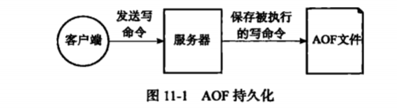
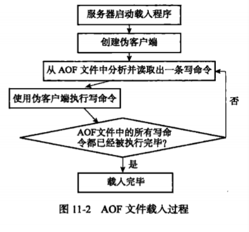
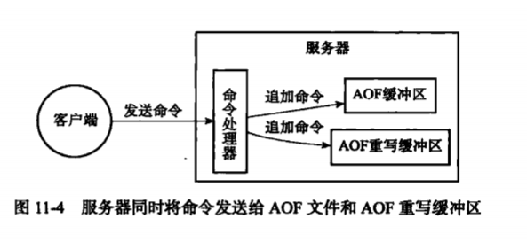

## AOF 持久化
　　**RDB 持久化是保存数据库的键值对数据，AOF 持久化是保存 Redis 服务器所执行的写命令。** 服务器在启动时，通过载入和执行 AOF 文件中保存的命令来还原服务器关闭之前的数据库状态。
  


### AOF 持久化的实现
　　AOF 持久化功能的实现分为追加（append）、文件写入、文件同步（sync）是三个步骤。

#### 命令追加
　　当 AOF 持久化功能处于打开状态时，服务器在执行完一个写入命令后，会以协议格式将被执行的写命令追加到服务器状态的 aof_buf 缓存区的末尾。举例，客户端向服务器发送 "redis>SET KEY VALUE"，则服务器在执行这个 SET 命令后，会将以下协议内容追加到 aof_buf 缓冲区的末尾：


#### AOF 文件的写入与同步
　　Redis 的服务器进程是一个事件循环，这个循环中的文件事件负责接收客户端的命令请求，以及向客户端发送命令回复，而时间事件则负责执行像 serverCron 函数这样需要定时运行的函数。<br />
　　服务器在处理文件事件时执行的写命令，是先写入到 aof_buf 缓冲区里的，过段时间（每结束一个事件循环），调用 flushAppendOnlyFile 函数，批量写入到 AOF 文件中。<br />
　　这是为了提高文件的写入效率，但存在宕机内存缓冲区的数据，没写入磁盘，则会丢失这部分的数据。可使用 fsync 和 fdatasync 两个同步函数，强制写入到磁盘。这种先写缓冲区，在批量写入到磁盘中思想，在很多地方都有用到。比如 CPU 中从内存读取值到 CPU 内存中，CPU 将值修改后不是立刻写回内存中，而是先写到内存缓冲区，再批量写到内存中，这也是多线程导致值不一样的原因之一。

#### AOF 文件的载入与数据还原
　　因为 AOF 文件保存了重建数据库状态所需的所有写命令，服务器只要读入并重新执行一遍 AOF 文件里保存的写命令，就可以还原服务器关闭之前的数据库状态。



　　注意，通常情况下，Redis 只会将那些对数据库进行修改的命令写入到 AOF 文件中，并复制到各个从服务器，像只读命令，不会写入到 AOF 文件中。但有两个命令是例外的，PUBSUB 命令和 SCRIPT LOAD 命令。

- PUBSUB 命令虽没有修改数据库，但 PUBSUB 命令向频道的所有订阅者发送消息，而接收到消息的所有客户端的状态都会因为这个命令而改变；
- 同理 SCRIPT LOAD 岁没有修改数据库，但修改了服务器状态。

### AOF 重写
　　AOF 持久化是是通过保存被执行的写命令来记录数据库状态的，随着服务器运行，文件越大，使用 AOF 文件载入还原的时间就越长。AOF 重写可以减少 AOF 文件的大小，解决 AOF 文件过大问题。<br />
　　**AOF 文件重写并不是对现有的 AOF 文件进行任何读取、分析或写入操作，而是通过读取服务器当前的数据库状态来实现的，** 如下对 list 键执行以下命令：

```redis
redis> PRUSH list "A" "B"  // {"A", "B"}

redis>PRUSH list "C"    // {"A", "B", "C"}

redis>PRUSH list "D" "E"   // {"A", "B", "C", "D", "E"}
```

- AOF 持久化会写入三条命令；
- AOF 重写则比对当前数据库和原有数据库，缺少的数据则使用一条写命令补齐。比如上面的例子，使用 PRUSH list "A", "B", "C", "D", "E" 补齐，代替了 AOF 文件中的三条命令。

　　AOF 重写功能是， **从数据库中读取键现在的值，然后用一条命令去记录键值对，代替之前记录这个键值对的多条命令。**<br />
　　实际情况，为避免在执行命令时造成客户端输入缓冲区溢出，重写程序在处理列表、哈希表、集合、有序集合这四种可能会带有多个元素的键时，会先检查键所包含的元素数量，比如列表中的元素数量或包含多个键值对的哈希表键数量超过了 redis.h / REDIS_AOF_REWRITE_ITEMS_PER_CMD 常量的值。**如果一次重写命令的键值对超过 64，则分多条命令进行。**

#### AOF 文件重写流程

- Redis 主线程创建一个子线程执行 AOF 重写，使用当前的数据副本，不阻塞当前主线程的命令操作（Redis 是单线程的）；
- 在子进程执行 AOF 重写，Redis 主线程设置了 AOF 重写缓冲区，将新的写命令追加到 AOF 缓冲区和 AOF 重写缓冲区；
- 当子进程完成 AOF 重写后，会向 Redis 主线程发送完成信号，这时 Redis 主线程会进行阻塞。
  1. 将 AOF 重写缓冲区的命令写入到新的 AOF 文件中；
  2. 新的 AOF 文件改名，覆盖掉旧的 AOF 文件；
  3. 完成替换后，取消阻塞，Redis 继续处理命令。


