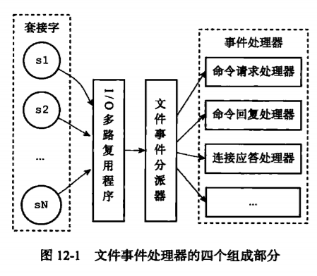
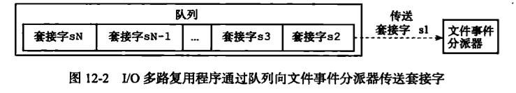
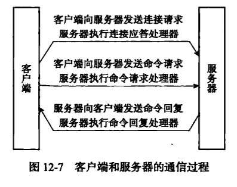
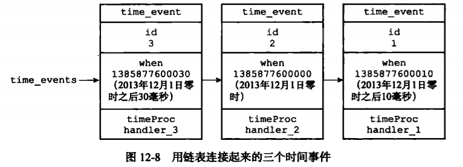
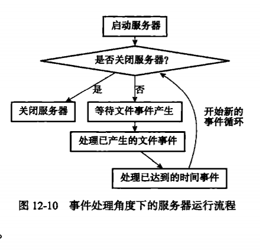

## 事件
　　Redis 服务器是事件驱动程序，服务器需要处理文件事件和时间事件这两类事件。

### 文件事件
　　Redis 服务器通过 Socket 与客户端（或其它 Redis 服务器）进行连接，而文件事件就是服务器对 Socket 操作的抽象。服务器与客户端（或其它服务器） 的通信会产生相应的文件事件，服务器通过监听并处理这些事件来完成一系列网络通信操作。

#### 文件事件处理器的构成
　　Redis 基于 Reactor 模式开发了网络事件处理器（文件事件处理器），虽然文件事件处理器以单线程方式运行，但通过使用 I/O 多路复用程序来监听多个 Socket，文件事件处理器既实现了高性能的网络通信模型，又很好与 Redis 服务器中其它同样以单线程方式运行的模块进行对接，保存了 Redis 内部单线程设计的简单性。 
　　文件事件处理器由四个部分组成，分布是套接字（Socket）、I/O 多路复用程序、文件事件分派器以及事件处理器。
  

  
- 文件事件是对 Socket 操作的抽象，Socket 在执行连接应答、读取、写入、关闭等操作时，会产生一个文件事件；
- I/O 多路复用程序负责监听多个 Socket，将产生新事件的 Socket 放到队列中，按照顺序发给文件事件分派器；
- 文件事件分派器接收到 I/O 多路复用程序传来的 Socket后，根据 Socket 产生的事件类型，调用对应的事件处理器。比如连接应答操作，则调用连接应答处理器；

- 服务器为执行不同任务的 Socket 关联不同的事件处理器，这些处理器是一个个函数，定义了某个时间发生时，服务器应执行的动作。

　　如下为 Redis 客户端与服务器进行连接并发送命令的过程为例。

### 时间事件

- 定时事件，比如在当前时间的 30 秒后执行一次；
- 周期性时间，每隔一段时间执行一次，如每隔 30 秒执行一次。

##### 时间事件构成

- id，服务器为时间事件创建的全局唯一 ID（标识号），从小到大顺序递增，ID 号越大，表明为新事件；
- when，毫秒精度，UNIX 时间戳，记录时间事件的到达时间；
- timeProc，时间事件处理器，一个函数，用于处理时间事件。

　　服务器将所有时间事件放在一个无序链表里，不按 when 排序。通过遍历链表，查询所有已到达的时间事件，调用相应的事件处理器。
  

#### 时间事件应用实例，serverCron 函数

- 更新服务器的各类统计信息，比如时间、内存占用、数据库占用情况等；
- 清理数据库中的过期键值对；
- 关闭和清理连接失效的客户端；
- 尝试进行 AOF 或 RDB 持久化操作；
- 如果服务器是主服务器，对从服务器进行定期同步；
- 如果处于集群模式，对集群进行定期同步和连接测试。

### 事件的调度与执行
　　因为服务器中同时存在文件事件和时间事件两种时间类型，所以服务器必须对这两种事件进行调度。事件的调度和执行规则：

- aeApiPoll 函数的最大阻塞时间由到达时间最接近当前时间的时间事件决定，避免服务器对时间事件进行频繁的轮询（忙等待），确保 aeApiPoll 函数不会阻塞过长时间；
- 服务器会循环等待处理文件事件，当时间事件的指定时间到达后，则在执行完当前的文件事件后，处理时间事件。所以时间事件的实际处理时间，通常比时间事件设定的到达时间要晚一些；
- 对文件事件和时间事件的处理都是同步、有序、原子地执行，不会中途中断时间处理，也不会对事件进行抢占。另外，时间事件也会将非常耗时的持久化操作放到子进程执行；

