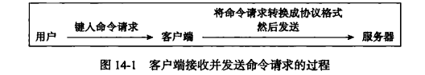
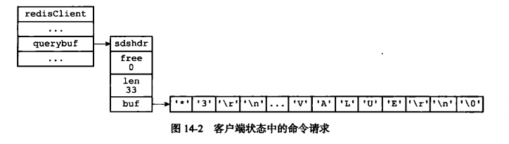
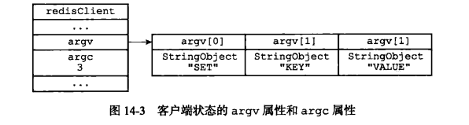
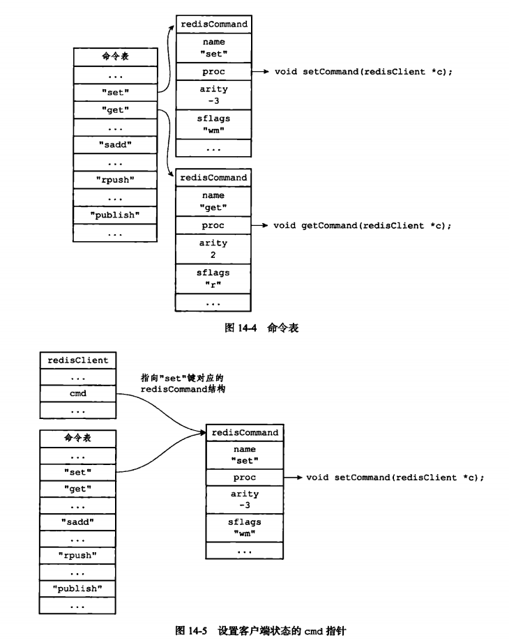
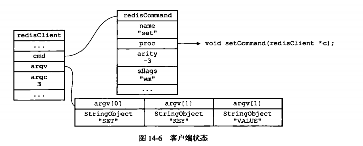
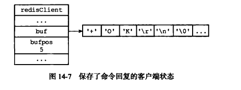
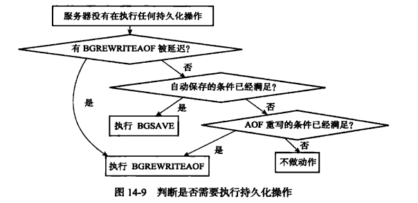

## 服务器
　　Redis 服务器负责与多个客户端建立网络连接，处理客户端发送的命令请求，在数据库中保存客户端执行命令所产生的的数据，并通过资源管理来维持服务器自身的运转。

### 命令请求的执行过程
　　举例，使用客户端发送 SET KEY VALUE 命令到获得回复 OK 期间，客户端和服务器需执行以下操作：

- 客户端向服务器发送命令请求 SET KEY VALUE；
- 服务器接收并处理客户端发来的命令请求 SET KEY VALUE，在数据库中进行设置操作，并产生命令回复 OK；
- 服务器将命令回复 OK 发送给客户端；
- 客户端接收服务器返回的命令回复 OK，并打印出来。

#### 发送命令请求
　　用户在 Redis 客户端输入命令请求，客户端会将这个命令请求转换成协议格式，通过连接到服务器的套接字，将协议格式的命令请求发送
给服务器。



#### 读取命令请求
　　当客户端与服务器之间的连接套接字因为客户端的写入而变得可读时，服务器将调用命令请求处理器执行以下操作：

- 读取套接字中协议格式的命令请求，并将其保存到客户端状态的输入缓冲区里；



- 对输入缓冲区中的命令请求进行分析，提取出命令请求中包含的命令参数，以及命令参数的个数，分别将参数和参数个数保存到客户端状态的 argv 属性和 argc 属性里；



- 调用命令执行器，执行客户端指定的命令。

#### 命令执行器（1），查找命令实现
　　首先根据客户端状态的 argv[0] 参数，在命令表中查找参数所指定的命令，并将找到的命令保存到客户端状态的 cmd 属性里。<br />
　　命令表是一个字典，字典的键是一个个命令名字，比如 "set"、"get"、"del" 等，而字典的值则是 redisCommand 结构，每个 redisCommand
结构记录了一个 Redis 命令的实现信息。以 SET 命令为例，程序以 argv[0] 作为输入，在命令表中进行查找，命令表将返回 “set”键对应的
 redisCommand 结构，客户端状态的 cmd 指针指向这个 redisCommand 结构，如下图：



#### 命令执行器（2），预备操作：
　　目前为止，服务器已经将执行命令所需的命令实现函数（保存在客户端的 cmd 属性）、参数（保存在客户端状态的 argv 属性）、参数个数（
保存在客户端状态的 argc 属性）都收集齐了，但程序在单机模式下还需做以下预备操作（如在集群模式将有更多预测操作）：

- 检查客户端状态的 cmd 指针是否指向 NULL，是则用户输入的命令找不到，返回错误；
- 根据客户端 cmd 属性指向的 redisCommand 结构的 arity 属性，检查命令请求所给定的参数个数是否正确。如 redisCommand 结构的 arity 属性的值为 -3，即用户输入的参数个数需大于等于3，否则报错；
- 检查客户端是否通过身份验证，未通过身份验证的客户端只能执行 AUTH 命令；
- 如果服务器打开了 maxmemory 功能，那么在执行命令前，会检查服务器的内存占用情况，需要是进行内存回收。如内存回收失败，则报错；
- 如果服务器上一次执行的是 BGSAVE 命令出错，并且服务器打开了 stop-writes-on-bgsave-error 功能。当服务器要执行的下一个命令是写命令时，则报错，拒绝执行命令；
- 如果服务器正在进行数据载入，那么客户端发送的命令必须带有 1 标识（如 INFO、SHUTDOWN、PUBLISH 等）才会被服务器执行，其他则拒绝；
- 如果客户端正在执行事务，那么服务器只会执行客户端发来的 EXEC、DISCARD、MULTI、WATCH 四个命令，其他命令会被排进事务队列中；
- 如果服务器打开监视器功能，那么服务器会将要执行的命令和参数等信息发给监视器。

　　完成以上预备操作，服务器开始真正执行命令。

#### 命令执行器（3），调用命令的实现函数
　　在前面的操作中，服务器已经将要执行命令的实现保存到了客户端状态的 cmd 属性里，并将命令的参数和个数分别保存到客户端状态的
argv 属性和 argc 属性里。当服务器决定执行命令时，只要执行以下语句：
```c
// client 是指向客户端状态的指针
clint->cmd-proc(clinet);

// 上面那句等于下面这句，执行语句
setCommand(client);
```



#### 命令执行器（3），调用命令的实现函数
　　在前面的操作中，服务器已经将要执行命令的实现保存到了客户端状态的 cmd 属性里，并将命令的参数和个数分别保存到客户端状态的
argv 属性和 argc 属性里。当服务器决定执行命令时，只要执行以下语句：
```c
// client 是指向客户端状态的指针
clint->cmd-proc(clinet);

// 上面那句等于下面这句，执行语句
setCommand(client);
```

　　被调用的命令实现函数会执行指定的操作，并产生相应的命令回复，这些回复会被保存在客户端状态的输出缓冲区里（buf 属性和 reply 属性），
之后实现函数还会为客户端的套接字关联命令回复处理器，这个处理器负责将命令返回给客户端。前面的 SET 命令，函数调用 setCommand(client) 将
产生一个 "+OK\r\n" 回复，这个回复会被保存到客户端状态的 buf 属性里。



#### 命令执行器（4），执行后续工作
　　执行完实现函数后，还有一些后续工作：

- 如果服务器开启慢查询日志功能，那么查询日志模块会检查是否需要为刚刚执行完的命令请求添加一条新的慢查询日志；
- 根据刚刚执行命令所耗费的时长，更新被执行命令的 redisCommand 结构的 millisecons 属性，并将命令的 redisComman 结构的 calls 计数器的值增一；
- 如果服务器开启了 AOF 持久化功能，会将刚刚执行的命令写入到 AOF 缓冲区里；
- 如果有其他从服务器再复制当前服务器，则会使用命令传播传给所有从服务器；

### serverCron 函数
　　Redis 服务器中的 serverCron 函数默认每隔 100 毫秒执行一次，负责管理服务器的资源。

#### 更新服务器时间的缓存
　　Redis 服务器有不少功能需要获取系统的当前时间，每获取一次当前时间就要调用一次，为减少调用次数，使用服务器中的 unixtime 属性
和 mstime 属性作为当前时间的缓存，每隔 100 毫秒存一次。由于其精度不高，所以只用在对时间精度不高的功能上。而对键设置过期时间、添加慢
查询等高精度要求的时间，会执行系统调用。

#### 更新 LRU 时钟
　　服务器状态中的 lrulock 属性保存了服务器的 LRU 时钟，属于时间缓存的一种，保存了对象最后一次被命令访问的时间，用于计算一个数据库键的空
转时间。

#### 更新服务器每秒执行的命令次数
　　serverCron 函数中的 trackOperationsPerSecond 函数以每 100 毫秒执行一次，通过抽样方式来估算服务器在最近一秒钟处理的命令请求数量。

#### 更新服务器内存峰值记录
　　服务器状态中的 stat_peak_memory 属性记录了服务器的内存峰值大小。

#### 处理 SIGTERM 信号
　　在启动服务器时，Redis 会为服务进程的 SIGTERM 信号关联处理器 sigtermHandler 函数，这个信号处理器负责在服务器接收到 SIGTERM 信号时，打开服务器状态的 shutdown_asap 标识。每次 serverCron 函数运行时，会根据 shutdown_asap 属性的值决定是否关闭
服务器。

#### 管理客户端资源
　　serverCron 函数每次执行都会调用 clientsCron 函数，对一定数量的客户端进行检查：
- 客户端与服务器连接超时，很长没互动，则释放这个客户端；
- 客户端在上一次执行命令请求后，输入缓冲区的大小超过一定长度，则程序会释放客户端当前的输入缓冲区，并重新创建一个默认大小的输入缓冲区，防止客户端的输入缓冲区耗费过多内存。

#### 管理数据库资源
　　serverCron 函数每次执行都会调用 databaseCron 函数，这个函数会对服务器中的一部分数据进行检查，删除过期键，并在有需要时，对字典进行收缩操作。

#### 执行被延迟的 BGREWRITEAOF 
　　在服务器执行 BGSAVE 命令期间，如客户端向服务器发来 BGREWRITEAOF 命令，那么会将 BGREWRITEAOF 命令延迟到 BGSAVE 命令执行后。

#### 检查持久化操作的运行状态

#### 检查持久化操作的运行状态
　　服务器状态使用 rdb_child_pid 属性和 aof_child_pid 属性记录执行 BGSAVE 命令和 BGREWRITEAOF 命令的子进程 ID。
  


#### 将 AOF 缓冲区中的内容写入 AOF 文件
　　如果服务器开启了 AOF 持久化功能，并且 AOF 缓冲区里待写入的数据，那么 serverCron 函数会调用相应程序，
将 AOF 缓冲区的内容写入到 AOF 文件里。

### 初始化服务器
　　初始化服务器状态，接受用户指定的服务器配置，创建相应的数据结构和网络连接等。


#### 初始化服务器状态
　　创建一个 struct redisServer 类型的实例变量 server 作为服务器的状态。执行 initServerConfig 函数，主要工作：

- 设置服务器的运行 ID；
- 设置服务器的默认运行频率；
- 设置服务器的默认配置文件路径；
- 设置服务器的运行架构；
- 设置服务器的默认端口号；
- 设置服务器默认的 RDB 持久化条件和 AOF 持久化条件；
- 初始化服务器的 LRU 时钟；
- 创建命令表

#### 载入服务器的配置选项
　　启动服务器时，通过给定配置参数或指定配置文件来修改服务器的默认配置。如在终端修改服务器的运行端口号：

```redis
redis-server --port 10086
```

#### 初始化服务器数据结构
　　在之前执行 initServerConfig 函数初始化 server 状态时，程序只创建了命令表一个数据结构。除命令表外，
服务器状态还包含其他数据结构，比如 server.clients 链表，server.db 数组等等。<br />
　　服务器会调用 initServer 函数，为以上数据结构分配内存，并在需要时，为这些数据结构设置或关联初始化值。服务器
需先载入用户指定的配置选项，才能正确地对数据结构进行初始化，因为配置选项涉及了数据结构的有关属性。

#### 还原数据库状态
　　完成对服务器状态 server 变量的初始化之后，服务器需要载入 RDB 文件或 AOF 文件，来还原服务器的数据库状态。
如果服务器启用 AOF 持久化功能，则载入 AOF 文件，否则使用 RDB 文件。

#### 执行事件循环
　　初始化最后一步为执行事件循环，至此初始化完成。
