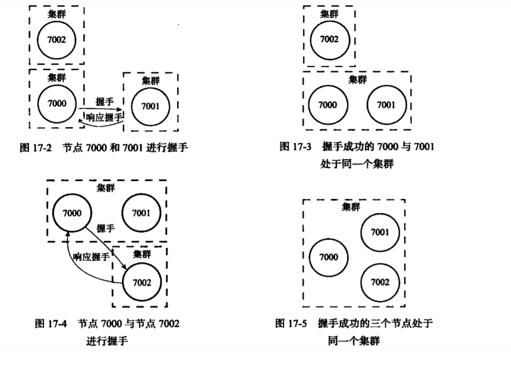
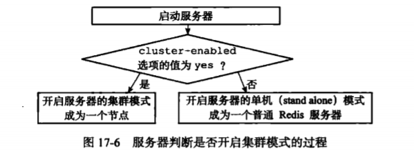
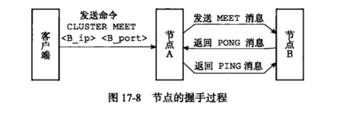
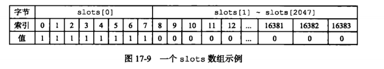
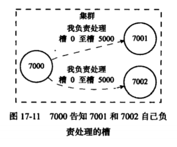
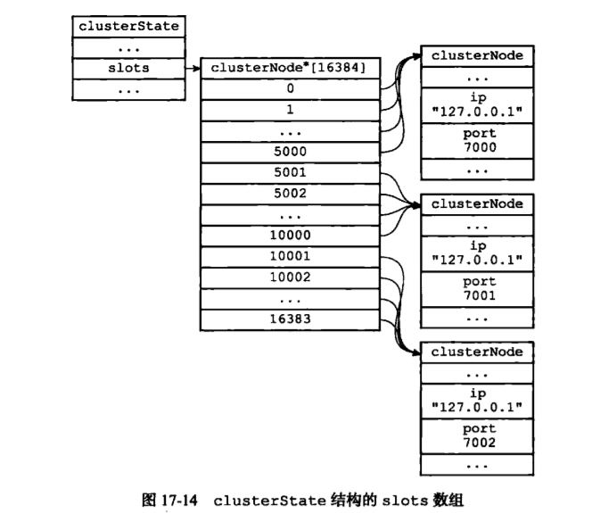
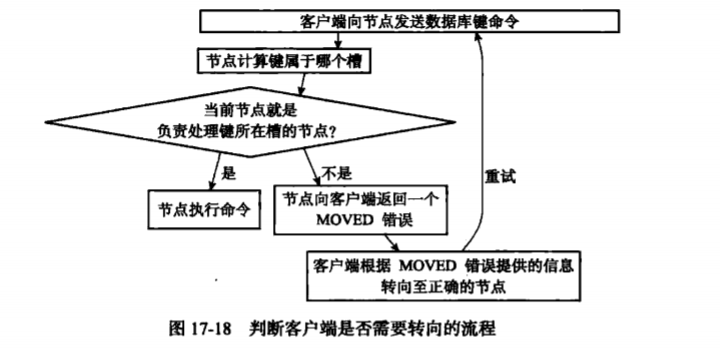

## 集群
　　Redis 的分布式数据库方案是使用集群，通过分片来实现数据分享、复制和故障转移功能。

### 节点
　　一个 Redis 集群通常由多个节点组成，刚开始节点都是相互独立的，通过向节点使用 CLUSTER MEET 命令，让 node 节点与 ip 和 port 所指定的节点进行握手，握手成功后，node 节点将 ip 和 port 所指定的节点添加到 node 节点当前所在的集群中。如下，为握手的过程：
  


#### 启动节点
　　一个节点就是一个运行在集群模式下的 Redis 服务器，通过设置 cluster-enabled 选项来选择在启动时是否开启服务器的集群模式。
  


#### 集群数据结构
　　每个节点都有对应的 clusterNode 和 clusterState。clusterNode 结构保持一个节点的当前状态，如节点的创建时间、名字、配置纪元等等。clusterState 结构则记录了在当前节点的视角下，集群所处的状态，如集群是在线还是下线，集群包含多少个节点。

#### CLUSTER MEET 命令实现
　　通过向节点 A 发送 CLUSTER MEET 命令使节点 A 与节点 B 进行握手，握手成功后，节点 A 将另一个节点 B 添加到 节点 A 当前所在的集群里：

- 节点 A 为节点 B 创建一个 clusterNode 结构，并将该结构添加到 clusterState.node 字典里；
- 节点 A 根据 CLUSTER MEET 命令给定的 IP 地址和端口号，向节点 B 发送一条 MEET 消息；
- 节点 B 收到节点 A 发送的 MEET 消息，同步骤一类似，节点 B 也为节点 A 创建clusterNode 结构，并将该结构添加到 clusterState.node 字典里，并向节点 A 返回一条 PONG 消息；
- 节点 A 收到 节点 B 返回的 PONG 消息，向节点 B 返回一条 PING 消息；
- 节点 B 收到节点 A 返回的 PING 消息，握手成功。



#### 槽指派
　　Redis 集群通过分片的方式来保存数据库中的键值对，集群的整个数据库被分为 16384 个槽，数据库中的每个键都属于这 16384 个槽的其中一个，集群中的每个节点可处理 0 个或最多 16384 个槽。<br />
　　当数据库中的 16384 个槽都有节点在处理时，集群处于上线状态，相反有任何一个槽没处理，则处于下线状态。使用 CLUSTER ADDSLOTS 命令，将槽指派给节点负责，如下将槽 0 至槽 5000 指派给节点 7000 负责：
  
```redis
127.0.0.1:7000> CLUSTER ADDSLOTS 0 1 2 3 4 ... 5000
```

#### 记录节点的槽指派信息
　　clusterNode 结构的 slots 属性和 numslot 属性记录了节点负责处理哪些槽：

- slots 属性是一个二进制位数组，数组的长度为 16384 / 8 = 2048 个字节，包含 16384 个二进制位，即有 16384 个索引，如果该索引位为 1，表示节点负责处理槽 i，如下图为处理槽 0 至槽 7：



- numslots 属性记录节点负责处理的槽的数量，即 slots 数组中值为 1 的二进制位的数量，如上图为 8。

#### 传播节点的槽指派信息
　　节点会将自己的 slots 数组通过消息发送给集群中的其它节点，告知其它节点自己目前负责处理哪些槽。<br />
　　如下图节点 7000 将自己的 slots 数组发给节点 7001 和节点 7002，告知这两个节点，自己负责处理槽 0 至槽 5000。而 7001 和 7002 接收到节点 7000 的slots 数组后，分别在自己的 clusterState.nodes 字典中查找节点 7000 对应的 clusterNode 结构，并对结构中的 slots 数组进行保存或更新，这样集群中的每个节点都会知道数据库中的 16384 个槽分别被指派给了集群中的哪些节点。
  


#### 记录集群所有槽的指派信息
　　clusterState 结构中的 slots 数组记录了集群中所有 16483 个槽的指派信息，每个槽（数组项）都是一个指向 clusterNode 结构的指针，即指派给 clusterNode 结构所代表的节点。<br />
　　与前面提到的 clusterNode 进行区别，clusterNode 是保存各个节点的槽指派信息，而为了知道某个槽是否被指派，则需要进行遍历 clusterState.nodes 字典中的所有 clusterNode 结构，检查这些结构的 slots 数组，直到找到负责处理槽 i 的节点为止，复杂度为 O(n)。<br />
　　而 clusterState.slots 数组，将所有槽的指派信息保存在数组里，访问 clusterState.slots[i] 的值即可获知改成槽处理的节点的，复杂度为 O(1)。<br />
　　总结下，clusterState.slots 数组记录了集群中所有槽的指派信息，而 clusterNode.slots 数组只记录了 clusterNode 结构所代表的节点的槽指派信息。
  


#### CLUSTER ADDSLOTS 命令的实现
　　CLUSTER ADDSLOTS 命令接受一个或多个槽作为参数，并将所有输入的槽指派给接受该命令的节点负责。

### 在集群中执行命令
　　在对数据库中的 16384 个槽都进行指派后，集群进入上线状态，客户端可对集群中的节点发送数据命令，节点会检查该命令要处理的数据库属于哪个槽，并检查这个槽是否指派给自己，如下图：
  


#### 计算键属于哪个槽
　　节点使用以下算法来计算给定键 key 属于哪个槽，CRC16（key）语句用于计算键 key 的 CRC-16 校验和，而 & 16383 语句用于计算出一个介于 0 至 16383 之间的整数作为键 key 的槽号：
  
```python
def slot_number(key):
    return CRC16(key) & 16383
```

#### 判断槽是否由当前节点负责处理
　　当节点计算出键所属的槽 i 之后，会检查在 clusterState.slots 数组中的项 i，判断键所在的槽是否由自己负责。是则节点执行客户单发送的命令，否则节点根据 clusterState.slots[i] 指向的 clusterNode 结构所记录的节点 IP 和端口号，向客户端返回 MOVED 错误，指引客户端转向正在处理槽 i  的节点。

#### MOVED 错误
　　当节点发现键所在的槽并非由自己负责处理时，会向客户端返回一个 MOVED 错误（在集群模式下是不会打印错误的），指引客户单转向正在负责槽的节点。<br />
　　一个集群客户通常会与集群中的多个节点创建套接字连接，而节点转向实际上是换一个套接字（服务器）来发送命令。

#### 节点数据库的实现
　　集群节点保存键值对以及键值对过期时间的方式，同第九章介绍的 Redis 服务器保存键值对以及键值对过期时间的方式是一样的。<br />
　　节点和单机服务器在数据库的区别是，节点只能使用 0 号数据库，而单机服务器则没限制。

### 重新分片
　　Redis 集群的重新分片用于将任意数量已经指派给某个节点（源节点）的槽改为指派给另一个节点（目标节点），并且槽相关所属的键值对也会从源节点被移动到目标节点。

#### 重新分片的实现原理
　　Redis 集群的重新分片操作由 Redis 的集群管理软件 redis-trib 执行的，其对集群的单个槽 slot 进行重新分片的步骤如下：
  
- redis-trib 对目标节点发送 CLUSTER SETSLOT 
