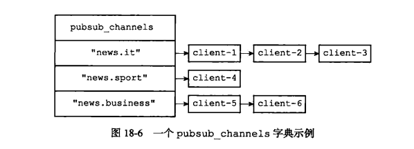
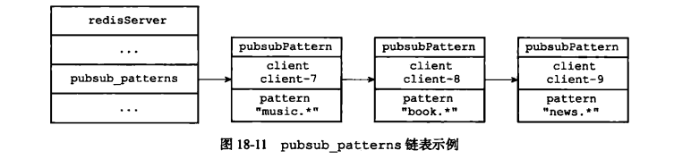
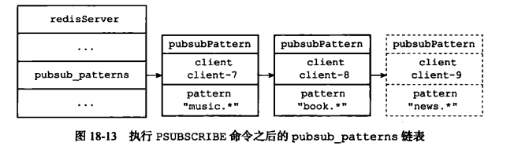
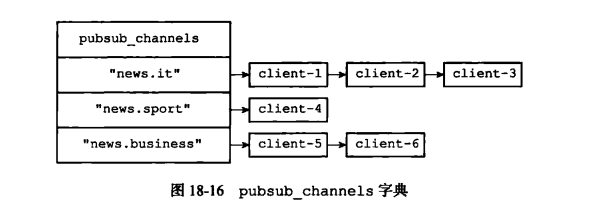
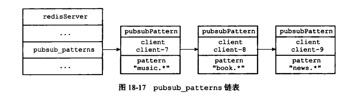
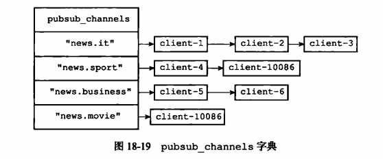
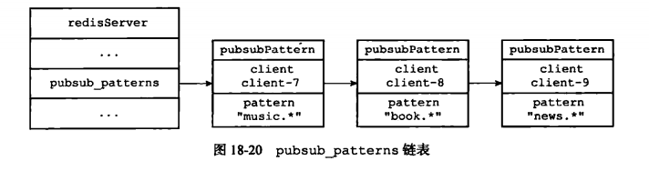

## 发布与订阅
　　Redis 的发布与订阅功能由 PUBLISH、SUBSCRIBE、PSUBSCRIBE 等命令组成。

### 频道的订阅与退订
　　Redis 将所有频道的订阅关系都保存在服务器状态的 pubsub_channels 字典里，这个字典的键是某个被订阅的频道，键的值是一个链表，记录了所有订阅这个频道的客户端。如下图，为一个 pubsub_channels 字典示例，"news.it"、"news.sport"、"news.business" 为键值，表示被订阅的频道，键值对应的值为链表，即订阅该频道的客户端，client-1、client-2、client-3 三个客户端订阅了 "news.it" 频道。
  

#### 订阅频道
　　执行 SUBSCRIBE 命令，即对 pubsub_channels 字典进行添加操作。在关联时，如果键值对已存在，则将客户端添加到订阅者链表的末尾。如不存在，则在 pubsub_channels 字典中创建一个键值对，键为频道，值为链表，将客户端添加到链表。

#### 退订频道
　　UNSUBSCRIBE 命令用于退订频道，即对 pubsub_channels 字典进行删除操作。根据退订频道的名字（键），在 pubsub_channels 字典中找到频道对应的订阅者链表，从链表中删除退订客户端的信息。如果删除后链表为空链条，则删除对应频道的键。

### 模式的订阅与退订
　　pubsub_patterns 属性则保存所有模式的订阅关系，它是一个链表，链表中的每个节点都包含着一个 pubsub_pattern 结构，这个结构的 pattern 属性记录了被订阅的模式，而 client 属性则记录了订阅模式的客户端，如下图：
  

#### 订阅模式
　　客户端执行 PSUBSCRIBE 命令订阅某个模式时：
  
- 新建一个 pubsubPattern 结构，将结构的 pattern 属性设置为被订阅的模式，client 属性设置为订阅模式的客户端；
- 将 pubsubPattern 结构添加到 pubsub_patterns 链表的末尾。

　　如下图，客户端 client-9 执行命令，PSUBSCRIBE "news.*"
  

#### 退订模式
　　PUNSUBSCRIBE 为退订命令，即在 pubsub_patterns 链表中查找并删除那些 pattern 属性为被退订模式。

### 发送消息
　　PUBLISH &lt;channel&gt; &lt;message&gt; 命令用于将消息 message 发送给对应频道。

#### 将消息发送给频道订阅者
　　所有频道的订阅关系都记录在 pubsub_channels 字典中，为了将消息发送给 channel 频道的所有订阅者，需要遍历频道 channel 链表，找到对应频道，然后发送给该频道上所有客户端。以下图为例，执行命令 PUBLISH "news.it" "hello"，在 pubsub_channels 字典中查找键“news.it”对应的链表值，遍历链表将消息“hello”发送给“news.it”频道的三个订阅者，client-1、client-2、client3。 

#### 将消息发送给模式订阅者
　　pubsub_patterns 链表记录了所有模式的订阅关系，通过遍历 pubsub_patterns 链表，找到那些与 channel 频道相匹配的模式，并将消息发送给订阅了这些模式的客户端，如下图，以 PUBLISH "news.it" "hello" 命令为例，遍历 pubsub_patterns 链表，找到节点值 pattern 模式为 "news.*"，然后将消息发送给该节点，即客户端 client-9。
  

### 查看订阅信息
　　PUBSUB 命令的三个子命令都是通过遍历链表来实现，返回满足条件的订阅信息。

#### PUBSUB CHANNELS
　　PUBSUB CHANNELS[pattern] 子命令通过遍历服务器 pubsub_channels 字典的所有键（频道），返回所有符合条件的频道列表。

#### PUBSUB NUMSUB
　　PUBSUB NUMSUB [channel-1 channel-2 ... channel-n] 子命令通过遍历 pubsub_channels 字典找到对应频道的订阅者链表，返回订阅者链表的长度，即频道的订阅者数量。举例，PUBSUB NUMSUB news.it，则在 pubsub_channels 找到键值为 "news.it"，返回该键值的链表长度。
  

#### PUBSUB NUMPAT 
　　PUBSUB NUMPAT 通过返回 pubsub_patterns 链表的长度来返回服务器当前被订阅模式的数量。
  

