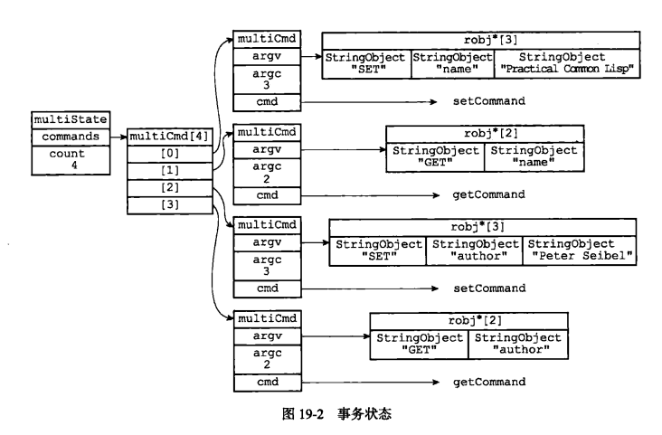
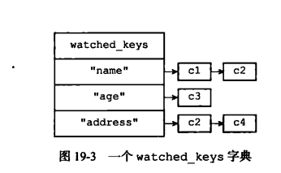

## 事务
　　事务提供了一种将多个命令请求打包，然后一次性、按顺序地执行多个命令的机制，并且在事务执行期间，服务器会将事务中的所有命令都执行完后，才去处理其他客户端的命令。

### 事务的实现
　　事务的实现经过三个阶段：

- **事务开始。**使用 MULTI 命令将执行该命令的客户端从非事务状态切换至事务状态；
- **命令入队。**切换为事务状态后，当客户端发送的命令是 EXEC、DISCARD、WATCH、MULTI 四个命令以外的其他命令，服务器会将这个命令放入一个事务队列里，然后向客户端返回 QUEUED 回复；
- **事务队列。**每个 Redis 客户端都有自己的事务状态，该事务状态包含一个事务队列，以及一个已入队命令的计数器（事务队列的长度）。事务队列是一个 multiCmd 类型的数组，数组中的每个 multiCmd 结构都保存了一个已入队命令的相关信息，包括指向命令实现函数的指针、命令的参数，以及参数的数量。事务队列以先进先出（FIFO）的方式保存入队的命令，如下 multiState 包含 4 个命令，即 4 个 multiCmd。

#### 执行事务
　　EXEC 命令，会遍历客户端的事务队列，执行队列中保存的所有命令，将执行命名的结果返回给客户端。如上图的四个命令，首先执行 SET "name" "Practical Common Lisp"，接着执行 GET "name"，SET "author" "Peter Seibel"，GET "author"。

#### WATCH 命令的实现
　　WATCH 命令是一个乐观锁，在 EXEC 命令执行前，监视任意数量的数据库键，并在 EXEC 命令执行后，检查被监视的键是否有被修改过，如果是，服务器将拒绝执行事务。

#### 使用 WATCH 命令监视数据库键
　　每个 Redis 数据库都保存着一个 watched_keys 字典，这个字典的键是某个被 WATCH 命令监视的数据库键，而字典的值则是一个链表，链表中记录了所有监视相应数据库键的客户端。如下图，客户端 c1 和 c2 在监视键 "name"：
  

#### 监视机制的触发
　　对数据库进行修改的命令，会查看 watch_keys 字典，是否有客户端在监视刚刚被命令修改过的数据库键。如果有，则监视被修改键的客户端的 REDIS_DIRTY_CAS 标识打开，标识该客户端的事务安全性已经破坏。

#### 判断事务是否安全
　　当服务器执行 EXEC 命令后，服务器根据这个客户端是否打开了 REDIS_DIRTY_CAS 标识来决定是否执行事务，如标识打开，则被监视的键已修改，拒绝执行。如没打开，则为事务安全，执行事务。

### 事务的 ACID 性质
　　在 Redis 中，事务总是具有原子性、一致性和隔离性，并且当 Redis 运行在某种特定的持久化模式下时，事务也具有耐久性。

#### 原子性
　　原子性指数据库将事务中的多个操作当做一个整体来执行，即服务器要么执行事务中的所有操作，要么就一个操作也不执行。 
　　Redis 的事务和传统的关系型数据库事务的最大区别在于，Redis 不支持事务回滚机制（rollback），即使事务队列中的某个命令在执行期间出了错误，整个事务也会继续执行下去，直到将事务队列中的所有命令都执行完毕为止。

#### 一致性
　　一致性指数据库在执行事务之前是一致的，在事务执行后，无论事务是否执行成功，数据库也应该仍然是一致的。“一致”指的是数据符合数据库本身的定义和要求，没有包含非法或无效的错误数据。 
　　Redis 事务可能出错的地方：

- **入队错误。**如果一个事务在入队命令的过程中，出现了命令不存在，或命令格式不正确等情况，那么 Redis 将拒绝执行这个事务；
- **执行错误。**执行过程中发生的错误不能在入队时被服务器发现的错误，只能在命令实际执行时触发。即使在事务的执行过程中发生错误，服务器也不会中断事务的执行，会继续执行事务中余下的其他命令，并且已执行的命令（包括执行命令产生的结果）不会被出错的命令影响，即出错命令不会对数据库做任何修改，也不会对事务的一致性产生任何影响；
- **服务器停机。**如果 Redis 服务器在执行事务的过程中停机，根据服务器所使用的持久化模式，如果服务器运行在无持久化的内存模式下，则重启后的数据库是空表，而如果是运行在持久化模式下，RDB 模式或 AOF 模式，则服务器会使用 RDB 文件或 AOF 文件来恢复数据，保持数据一致性。

#### 隔离性
　　隔离性指即使数据库中有多个事务并发地执行，各个事务之间也不会互相影响，并且在并发状态下执行的事务和串行执行事务产生的结果相同。 
　　因为 Redis 使用单线程的方式来执行事务以及事务队列中的命令，并且服务器保证在执行事务期间不会对事务进行中断。因此，Redis 的事务总是以串行的方式运行的，并且事务也总是具有隔离性。

#### 耐久性
　　事务的耐久性指的是，当一个事务执行完毕后，执行这个事务所得的结果已经被保存到永久性存储介质（比如硬盘）里，即使服务器在事务执行完毕后停机，执行事务所得的结果也不会丢失。 
　　Redis 的事务是用队列将一部命令包裹起来，并没有为事务提供任何额外的持久化功能，所以 Redis 事务的持久性由 Redis 所使用的持久化模式（RDB 模式或 AOF 模式）决定。
