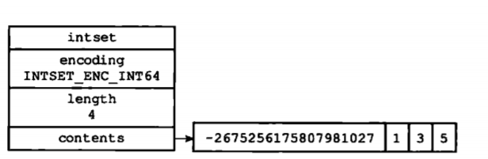
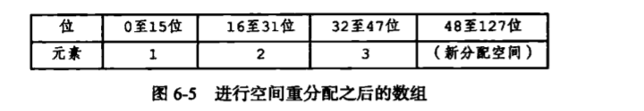
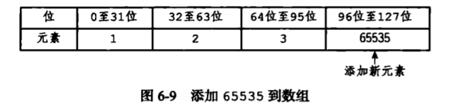

## 整数集合
　　整数集合是用于保存整数值的集合抽象数据结构，是集合键的底层实现之一。当一个集合只包含整数值元素，并且这个集合的元素数量不多时，就会使用整数集合作为集合键的底层实现。<br />
　　整数集合可以保存类型为 int16_6、int32_t 或 int64_t 的整数值，并且集合中不会出现重复元素。
  
```c
typedef struct inset {
    // 编号方式
    unit32_t encoding;
    // 集合包含的元素数量
    unit32_t length;
    // 保存元素的数组
    int8_t contents[];
} intset;
```

　　整数集合的每个元素都是 contents 数组的一个数组项，并且按照从小到大顺序排列，不包含重复项。length 属性为整数集合包含的元素数量，即 contents 数组长度。注意，虽然 intset 结构将 contents 属性声明为 int8_t 类型的数组，但并不保存任何 int8_t 类型的值，contents 数组的类型取决于 encoding 属性的值。如果 encoding 属性的值为 INTSET_ENC_INT16，则 contents 为 int16_t 类型的数组。如下为一个包含 int64_t 的整数集合，数值按从小到大进行排序。<br />
　　虽然 contents 数组保存的四个整数值中，只有第一位 -2675256175807981027 是真正用 int64_t 保存的，其余是用 int16_t 保存。但根据整数集合的升级规则，当往一个 int16_t 数组的整数集合添加一个 int64_t 的整数集合时，所有元素都会转为 int64_t 类型。
  


### 升级
　　升级整数集合，并添加新元素分为三步：
- 根据新元素的类型，扩展整数集合底层数组的空间大小，并为新元素分配空间。比如有一个 INTSET_ENC_INT16 编码的整数集合，包含三个 int16_t 类型的元素，即每个元素占用 16 位空间，所以数组大小为 3 * 16 = 48，假设要将 int_32t 的整数值 65535 添加进来，需升级为 int_32t，并且重新分配四个元素的空间，为 32 * 4 = 128；
- 将底层数组现有的所有元素都转换成与新元素相同的类型，并将类型转换后的元素放置到正确的位置上，在放置过程，需保持元素的顺序不变，即从小到大排序。如下，首先 3 在四个元素中排第三，所以索引为 2（从 0 开始计算），于是 2 的索引位置是从 64 位到 95 位的空间，移动到这里，其余也是类似计算；



- 将新元素添加到底层数组里。新元素 65535 在四个元素中排第四，所以添加到 contents 数组的索引 3 位置上，即 96 位到 127 位的空间。



　　每次向整数集合添加新元素都可能会引起升级，导致重新分配空间，遍历元素进行类型转换，所以向整数集合添加新元素的时间复杂度为 O(N)。<br />
　　整数集合不支持降级操作，一旦升级，就保持升级后的状态。如添加一个 int64_t 类型的值升级到 int64_t，就保持 int64_t 的数组，即使之后又删去 int64_t 类型的值。

### 升级好处
- 提升整数集合的灵活性，添加新类型可以自动升级为新类型的数组，如 int16_t 的数组添加一个 int32_t 的值，则升级为 int32_t 的数组；
- 节约内存，只有添加 int64_t 时才会升级为 int64_t 的数组，平常为 int16_t 数组；

### 总结

- 整数集合是集合键的底层实现之一；
- 整数集合的底层实现为数组，这个数组以有序、无重复的方式保存集合元素，在有需要时，程序会根据新添加元素的类型，改变数组的类型；
- 升级操作为整数集合带来操作上的灵活性，并尽可能地节约内存；
- 整数集合只支持升级操作，不支持降级操作；
