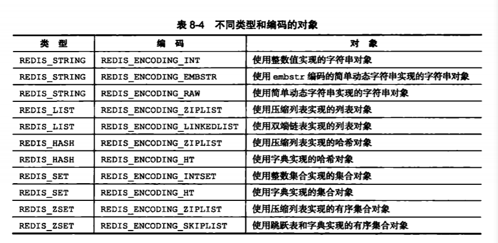
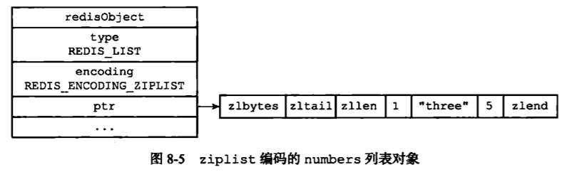
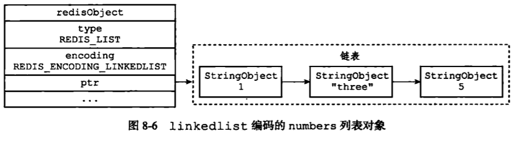
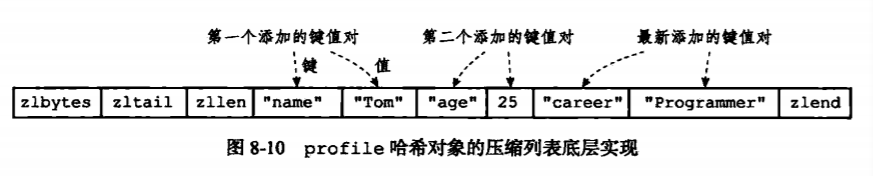
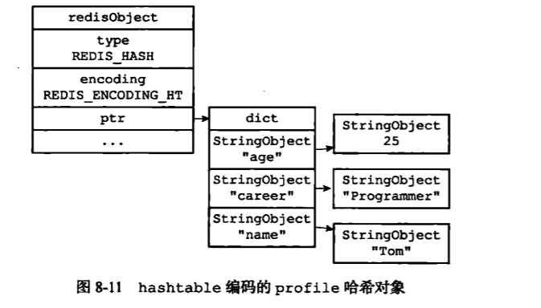
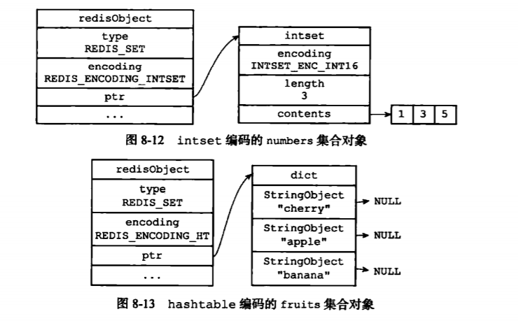
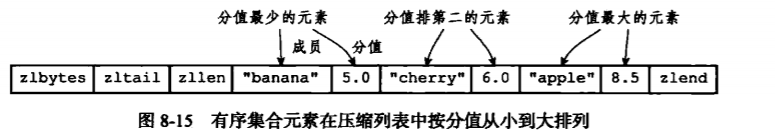
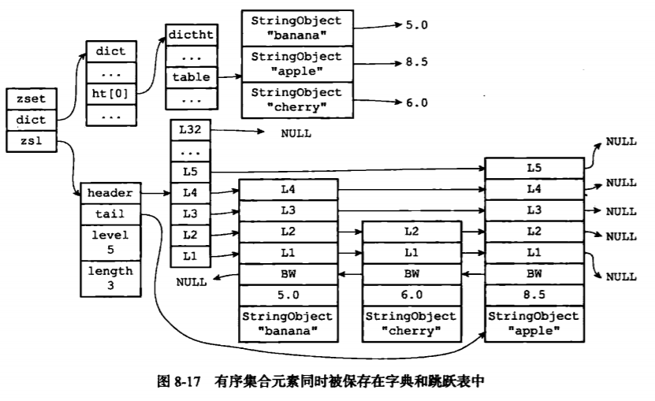
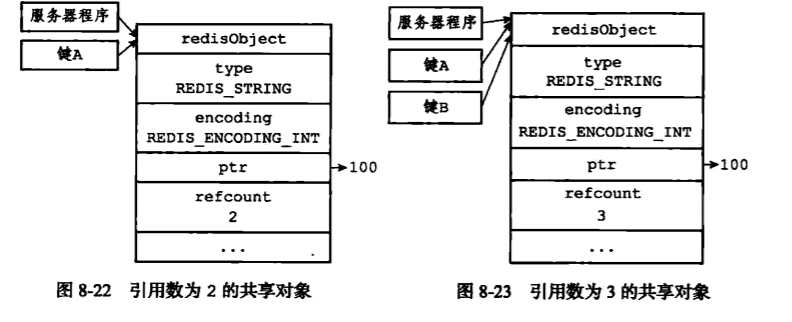

## 对象
　　Redis 的主要数据结构有简单动态字符串（SDS）、双端链表、字典、压缩列表、整数集合等，但 Redis 没有直接使用这些数据结构来实现键值对数据库，而是基于这些数据结构创建一个对象系统，这个系统包括字符串对象、列表对象、哈希对象、集合对象和有序集合对象这五种类型的对象，通过对象的类型来判断一个对象是否可以执行给定的命令。

### 对象的类型与编码
　　Redis 使用对象来表示数据库中的键和值，即有两个对象，一个为键对象，一个为值对象。<br />
　　Redis 中的每个对象都由一个 RedisObject 结构表示，如下：

```c
typedef struct redisObject {
    // 类型
    unsigned type: 4;
    // 编码
    unsigned encoding: 4;
    // 指向底层实现数据结构的指针
    void *ptr;
    // ...
} robj;
```

- 对象的 type 属性记录了对象的类型。Redis 的键值对中，键总是一个字符串对象，而值可以是字符串对象、列表对象、哈希对象、集合对象和有序集合对象这五种类型的对象这五种；
- 编码和底层实现，对象的 ptr 指针指向对象的底层实现数据结构，而这些数据结构由对象的 encoding 属性决定，它记录了对象所使用的编码，即用什么数据结构作为对象的底层实现。每个对象都至少使用两种不同的编码，比如列表对象就有用压缩列表或双端列表实现的，这样根据不同使用场景来为一个对象设置不同的编码，当元素量少使用压缩列表，多时在转换成双端链表，优化对象在某一场景下的效率；



### 字符串对象
　　字符串对象的编码可以是 int、raw 或 embstr。
  
- 字符串对象保存的是整数值，且用 long 类型表示，则该字符串对象的编码设置为 int；
- 保存的是字符串值，且该字符串值长度大于 32 字节，则使用 SDS 来保存，编码设置为 raw；
- 保存的是字符串值，且该字符串值长度小于等于 32 字节，则使用 embstr 编码。

　　embstr 编码是专门用来保存短字符串的一种优化编码方式，与 raw 相比：
- embstr 编码将创建字符串对象所需的内存分配次数从 raw 编码的两次降低为一次。因为 raw 编码调用两次内存分配函数来分别创建 RedisObject 结构和 sdshbr 结构，而 embstr 编码则调用一次内存分配函数来分配一块包含 RedisObject 和 sdshbr 结构的连续空间；
- 于是，释放 embstr 编码的字符串对象只需要调用一次内存释放函数，因为是一块连续空间，而 raw 需要两次；
- 并且，embstr 的字符串对象是保存在一块连续的内存里，所有能更好地利用缓存带来的优势。

### 列表对象
　　列表对象的编码为使用压缩列表作为底层实现的 ziplist 或使用双端链表作为底层实现的 linkedlist。列表对象使用 ziplist 编码，需满足以下两个条件：
  
- 列表对象保存的所有字符串元素的长度都小于 64 字节；
- 列表对象保存的元素数量小于 512 个。



　　不满足时，则使用 linkedlist 编码。或是使用了 ziplist 编码的列表对象，但之后条件又不满足了（如列表元素过多，大于 512 个），则原本保存在压缩列表里的所有列表元素会转移并保存到双端链表里。
  


### 哈希对象
　　哈希对象的编码是 ziplist 或 hashtable。<br />
　　ziplist 编码的哈希对象使用压缩列表作为底层实现，当有新的键值对加入到哈希对象时，程序会先将保存了键的压缩列表节点推入到压缩列表表尾，保存的值也是推入到压缩列表表尾，因此：
  
- 同一键值对的两个节点是紧挨在一起的，键节点在前，值节点在后；
- 先添加到哈希对象的键值对放在压缩列表的表头，而后添加则放在表尾；



　　而使用 hashtable 编码的哈希对象使用字典作为底层实现，每个键值对都使用一个字典键值对来保存，如下图：



　　当哈希对象同时满足下面两个条件，则使用压缩列表 ziplist 编码，不满足则使用 hashtable 编码：
  
- 哈希对象保存的所有键值对的键和值的字符串长度都小于 64 字节；
- 哈希对象保存的键值对数量小于 512 个；

### 集合对象

　　集合对象的编码可以是使用整数集合作为底层实现的 intset 或使用字典作为底层实现的 hashtable，如下图：



　　当集合对象同时满足以下两个条件时，对象使用 intset 编码，不满足则使用 hashtable 编码：

- 集合对象保存的所有元素都是整数值；
- 集合对象保存的元素数量不超过 512 个。

### 有序集合对象
　　有序集合的编码可以是 ziplist 或 skiplist。<br />
　　ziplist 编码的压缩列表对象使用压缩列表作为底层实现，每个集合元素使用两个压缩节点，第一个节点保存元素的成员，第二个节点则保存元素的分值。压缩列表的集合元素按分值从小到大排序，分值较小的元素放在表头方向，分值大的放在表尾方向。
  


　　skiplist 编码的有序集合对象使用 zset 结构作为底层实现，一个 zset 结构同时包含一个字典和一个跳跃表。zset 结构中的 zsl 跳跃表按分值从小到大保存了所有集合元素，每个跳跃表节点都保存一个集合元素：节点的 object 属性保存元素成员，score 属性保存元素的值。通过跳跃表，可以进行范围操作，如 zrank、zrange等。另外，zset 结构中的 dict 字典为有序集合创建了一个从成员到分值的映射。通过字典，可以在 O(1) 复杂度下查找给定成员的值。<br />
　　注意，虽然 zset 结构同时使用跳跃表和字典来保存有序集合的元素，但这两种数据结构都通过指针来共享相同元素的成员和值，不会出现重复元素和浪费额外内存。<br />
　　之所以有序集合要同时使用跳跃表和字典来实现，是考虑到性能问题。字典在获取成员值是 O(1) 复杂度，而范围操作使用跳跃表来实现更好。
　　


　　当有序集合同时满足以下两个条件时，使用 ziplist 编码，否则使用  skiplist 编码：

- 有序集合保存的元素数量小于 128 个；
- 有序集合保存的所有元素成员的长度都小于 64 字节；

### 内存回收
　　Redis 使用引用计数的内存回收机制，通过跟踪对象的引用计数信息，在适当的时候自动释放对象并进行内存回收。
  
- 创建一个新对象时，引用计数的值初始化为 1；
- 当对象被一个新程序使用时，引用计数值加一；
- 当对象不再被一个程序使用时，引用计数值减一；
- 当对象的引用计数值变为 0 时，释放内存。

### 对象共享
　　对象的引用计数属性还带有对象共享作用，比如键 A 创建一个包含整数值 100 的字符串对象作为值对象，键 B 也是。这时键 A 和键 B 的指针指向同一个现有值的对象，即引用是相同的。<br />
　　Redis 在初始化服务器时，会创建一万个字符串对象，包含从 0 到 9999 的所有整数值。当服务器用到这些值时，会使用共享对象，而不是新创建对象，如下：
  


### 对象的空转时长
　　RedisObject 结构包含的属性有 type、encoding、ptr、refcount 和 lru 属性，lru 属性记录对象最后一次被命令程序访问的时间，通过当前时间减去键的值对象的 lru 时间可计算出空转时长。<br />
　　当服务器打开 maxmemory选项，回收内存算法为 volatile-lru 或 allkeys-lru，则当服务器占用的内存数超过 maxmemory 选项设的上限值时，空转时长较高的部分键会被服务器优先释放，回收内存。
