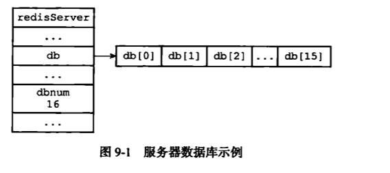
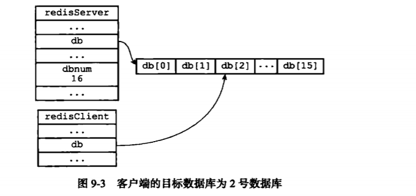
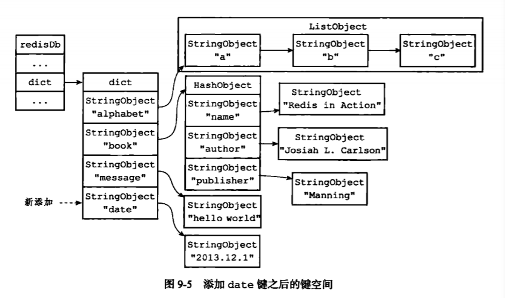
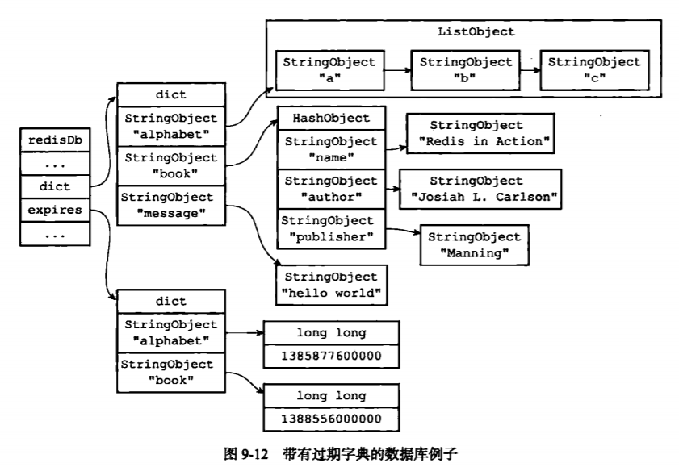

## 数据库
　　Redis 服务器将所有数据库保存在服务器状态 redis.h / redisServer 结构的 db 数组中，db 数组的每个项都是一个 redis.h / redisDb 结构，每个 redisDb 结构代表一个数据库：

```c
struct redisServer {
    // ...
    // 一个数组，保存着服务器中的所有数据库
    redisDb *db;
    // ...
}
```

　　在初始化服务器时，根据服务器状态的 dbnum 属性决定创建多少个数据库，默认为 16 个：



### 切换数据库
　　每个 Redis 客户端都有自己的目标数据库，用于执行读或写命令，默认为 0 号数据库，可通过 SELECT 命令来切换目标数据库，它是通过修改 redisClient.db 指针，来指向切换不同数据库：



### 数据库键空间
　　Redis 是一个键值对的数据库服务器，服务器中的每个数据库都由一个  redis.h / redisDb 结构表示，其中 redisDb 结构的 dict 字典保存了数据库中的所有键值对，将这个字典称为键空间。因为数据库的键空间是一个字典，所以针对数据库的操作，其实是对键空间字典进行操作来实现的。<br />
　　比如，添加一个新键值对到数据库，实际上是将一个新键值对添加到键空间字典里，键为字符串对象，值为任意一种类型的 Redis 对象。
  


　　当使用 Redis 命令对数据库进行读写时，服务器不仅会对键空间执行指定的读写操作，还会执行一些额外的维护操作：

- 读取一个键后，服务器根据键是否存在来更新服务器的键空间命中（hit）次数或键空间不命中（miss）次数；
- 读取一个键后，服务器会更新键的 LRU（最后一次使用）时间，用于计算键的闲置时间以及释放内存；
- 如果在读取一个键发现该键过期，那么服务器会先删除这个过期键，然后执行剩下的其它操作；
- 如果有客户端使用 watch 命令监视某个键，那么服务器在对被监视的键进行修改后，会将这个键标记为脏（dirty），从而让事务程序注意到这个键已经被修改过；
- 服务器每次修改一个键后，都会对脏（dirty）键计数器的值加一，这个计数器会触发服务器的持久化以及复制操作；
- 如果服务器开始了数据库通知功能，那么在对键进行修改后，服务器将按配置发送相应的数据库通知。

### 设置键的生存时间或过期时间
　　通过 EXPIRE 命令或 PEXPIRE 命令，客户端可以按秒或毫秒精度为数据库中的某个键设置生存时间（Time To Live，TTL），经过指定的秒数或毫秒数后，服务器将自动删除生存时间为 0 的键，设置过期时间则使用 EXPIRE 命令或 PEXPIRE 命令，过期时间使用的是 UNIX 时间戳。TTL 命令和 PTTL 命令接收一个带有生成时间或过期时间的键，返回这个键的剩余生存时间，即这个键距离服务器自动删除还有多长时间。
  
```redis
redis> SET key value
ok

redis> EXPIRE key 5
(integer) 1

// 5 秒内
redis> GET key
"value"

// 5 秒后
redis> GET key
(nil)

// 设置过期时间
redis>EXPIREATE key 1377257300
```

#### 设置过期时间
　　Redis 有四个不同命令可设置键的生存时间（键能存在多久）或过期时间（键什么时候被删除）：
 
- EXPIRE &lt;key&gt; &lt;ttl&gt; 命令用于键 key 的生存时间设置为 ttl 毫秒；
- PEXPIRE &lt;key&gt; &lt;ttl&gt; 设置为 ttl 毫秒；
- EXPIREAT &lt;key&gt; &lt;timestamp&gt; 命令用于将键 key 的过期时间设置为 timestamp 所指定的秒数时间戳；
- PEXPIREAT &lt;key&gt; &lt;timestamp&gt; 指定毫秒时间戳；

　　虽然有四种命令，但实际上 EXPIRE、PEXPIRE、EXPIREAT 三个命令使用 PEXPIREAT 命令来实现，首先 EXPIRE 可转换成毫秒级的 PEXPIRE，在获取毫秒级的当前时间戳，加上 PEXPIRE，即为 PEXPIREAT。

#### 保存过期时间
　　redisDb 结构的 expires 字典保存了数据库中所有键的过期时间，称这个字典为过期字典：
  
- 过期字典的键是一个指针，这个指针指向键空间中的某个键对象，即某个数据库键；
- 过期字典的值是一个 long long 类型的整数，保存了键所指向的数据库键的过期时间，毫秒精度的 UNIX 时间戳。



　　注意，为展示方便，键空间和过期字典重复出现了两次 alphabet 键对象和 book 键对象。实际中，键空间和过期字典的键都指向同一个键对象。

#### 过期键的判定

- 检查给定键是否存在于过期字典，如果存在，获取键的过期时间；
- 计算当前 UNIX 时间戳是否大于键的过期时间，是则键过期。

### 过期键删除策略
　　下面三种策略，第一种和第三种为主动删除，第二种为被动删除：
  
- 定时删除，在设置键的过期时间同时，创建一个定时器，让定时器在键的过期时间来临时，立即执行对键的删除操作。这对内存最友好，但对 CPU 时间是最不友好的，在内存不紧张但 CPU 时间紧张时，将 CPU 时间用在删除和当前任务无关的过期键上，会影响服务器性能。另外，创建定时器要用 Redis 服务器中的时间事件，它是使用无序链表的，查找一个事件的时间复杂度为 O(N)，不能高效处理大量时间事件；
- 惰性删除，放任键过期不管，但每次从键空间中获取键时，都会检查键是否过期，过期则删除。对 CPU 时间最友好，但对内存最不友好，因为只有取出键才会进行检查。如果数据库有非常多过期键，且没有被访问，可看作内存泄露。比如和时间有关的数据，如日志（log），某个时间点后访问大量减少，但仍然存在，没有删除；
- 定期删除，每隔一段时间，进行一次检查，删除过期键，是前两种策略的折中，需设定删除操作执行的时长和效率。

　　Redis 服务器使用的是惰性策略和定期删除策略，这里定期删除策略是在规定的时间内，分多次遍历服务器中的各个数据库，从数据库的 expires 字典中随机检查一部分键的过期时间，并删除其中的过期键。
  
- 函数每次运行时，从一定数量的数据库中取出一定数量的随机键进行检查，并删除其中的过期键；
- 全局变量 current_db 记录当前函数检查的进度，在下一次函数调用时，接着上一次的进度进行处理。比如上一次遍历 10 号数据库，这次则从 11 号开始删除过期键；
- 随着函数不断执行，当所有数据库都检查一遍后，重置 current_db 为 0，重新开始新一轮检查。

### AOF、RDB 和复制功能对过期键的处理
　　RDB 持久化功能、AOF 持久化功能以及复制功能是用于处理数据库中的过期键。

#### RDB 文件
　　执行 SAVE 命令或 BGSAVE 命令可创建新的 RDB 文件，将数据库中的键保存到该文件中，但过期键会被忽略。在启动 Redis 服务器时，如果服务器开启了 RDB 功能，将对 RDB 文件进行载入：

- 服务器以主服务器模式运行，则在载入 RDB 文件时，会对文件中保存的键进行检查，未过期的键会载入到数据库，过期键则忽略；
- 服务器以服务器模式运行，则全部键都载入到数据库。

#### AOF 文件写入
　　当服务器以 AOF 持久化模式运行时，如果数据库中的某个键已过期，但还没被惰性删除或定期删除，AOF 文件不会受到影响。<br />
　　当过期键被惰性删除或定期删除后，程序会向 AOF 文件追加一条 DEL 命令，来显示记录该键已被删除。举例，当客户端使用 GET message 命令，访问过期的 message 键，数据库将执行以下操作：
  
- 从数据库中删除 message 键；
- 追加一条 DEL message 命令到 AOF 文件；
- 向执行 GET 命令的客户端返回空回复。

　　和生成 RDB 文件类似，执行 AOF 重写时，过期键不会保存到重写后的 AOF 文件中。

#### 复制
　　当服务器在复制模式下时，过期键的删除由主服务器来控制，这是为了保证主从服务器数据的一致性：

- 主服务器在删除一个过期键后，会显示向所有从服务器发送一个 DEL 命令，告知从服务器删除这个过期键；
- 从服务器只有在接到主服务发来的 DEL 命令后，才会删除过期键，否则即使读到过期键也不会删除。
