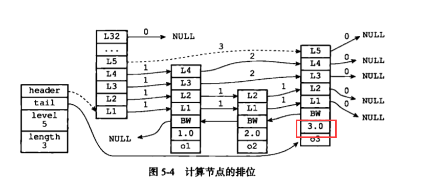

## 跳表
　　跳表（skiplist）是一种有序的数据结构，通过在每个节点中维持多个指向其它节点的指针，从而达到快速访问节点的目的。跳表支持平均 O(logN)、最坏 O(N) 复杂度的节点查找，还可通过顺序性操作来批量处理节点。<br />
　　如果一个有序集合包含的元素数量较多，或有序集合中元素的成员是比较长的字符串时，Redis 会使用跳表作为有序集合键的底层实现。**Redis 只在两个地方用到跳表，一个是实现有序集合键，另一个是在集群节点中用作内部数据结构。**

### 跳表的实现
　　Redis 的跳表由两个结构定义，zskiplistNode 结构用于表示跳表节点，而 zskiplist 结构则用于保存跳表节点的相关信息，比如节点的数量、指向表头节点和表尾节点的指针等。如下为一个跳表实例，最左边为 zskiplist 结构，该结构包含以下属性：

- header，指向跳表的表头节点；
- tail，指向跳表的表尾节点；
- level，记录目前跳表内，层数最大的那个节点的层数（表头节点的层数不计算在内）；
- length，记录跳表的长度，即跳跃表目前包含节点的数量（表头节点不计算在内）；


#### 跳跃表节点
　　跳跃表节点由 redis.h / zskiplistNode 结构定义：

```c
typedef struct zskiplistNode {
    // 层
    struct zskiplistLevel {
        // 前进指针
        struct zskiplistNode *forward;
        // 跨度
        unsigned int span;
    } level[];
    
    // 后退指针
    struct zskiplistNode *backward;
    // 分值
    double score;
    // 成员对象
    robj *obj;
} zskiplistNode;
```

- 层（level），跳表节点的 level 可以包含多个元素，每个元素都包含一个指向其它节点的指针，程序通过这些层来加快访问其他节点的速度，一般层的数量越多，访问其他节点的速度越快。节点中用 L1、L2、L3 等标记节点的各个层，L1 表示第一层。每次创建一个新的跳表节点的时候，都会随机生成一个介于 1 和 32 之间的值作为 level 数组的大小，这个大小就是层的高度；
- 前进指针，用于从表头向表尾方向访问节点，如下图中的虚线；
- 跨度，记录两个节点之间的距离。两个节点之间的跨度越大，相距越远。指向 NULL 的所有前进指针的跨度都为0，因为没有连接任何节点。跨度实际上是用来计算排位的，即在查找某个节点的过程中，将访问经过的所有层的跨度累计起来，得到的结果就是木桥节点在跳跃表中的排位。如下图，查找分值为 3.0，成员对象为 o3 节点，查找经过一层，但层的跨度为 3，所以排位为 3；



- 后退指针，从表尾向表头方向访问节点，跟一次可以跳过多个节点的前向指针不同，每个节点止只有一个后退指针，每次只能后退到前一个节点；
- 分值和成员，跳表中的所有节点都按分值从小到大排序，节点的成员对象是一个指针，指向一个保存着 SDS 值的字符串对象。同一个跳表中，各个节点保存的成员对象必须是唯一的，但是多个节点保存的分值可以是相同的，如下三个节点的分值相同。分值相同的节点将按照成员对象在字典序中的大小来进行排序，成员对象较小的节点排在前面。如下表示，o1、o2、o3 三个成员对象在字典中的排序为 o1 <= o2 <= o3；


　　使用 zskiplist 结构来组合这些点，zskiplist 带的属性能更快获取信息。如 header 和 tail 指针分别获取表头和表尾节点，length 属性记录节点的数量（跳表长度），level 属性获取跳表中层高最大的那个节点的层数量，注意表头节点的层高不算在内，这些操作都是 O(1)的。
  


### 总结

- 跳表是有序集合的底层实现之一；
- Redis 的跳表实现由 zskiplist 和 zskiplistNode 两个结构组成，其中 zskiplist 用于保存跳表信息（比如表头节点、表尾节点、长度），而 zskiplistNode 则用于表示跳跃表节点；
- 每个跳表节点的层高都是 1 至 32 之间的随机数；
- 在同一个跳跃表中，多个节点可以包含相同的分值，但每个节点的成员对象必须是唯一的；
- 跳表中的节点按照分值大小进行排序，当分值相同时，节点按照成员对象的大小进行排序。
