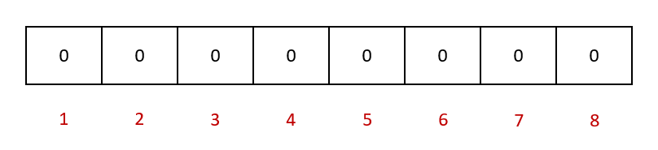
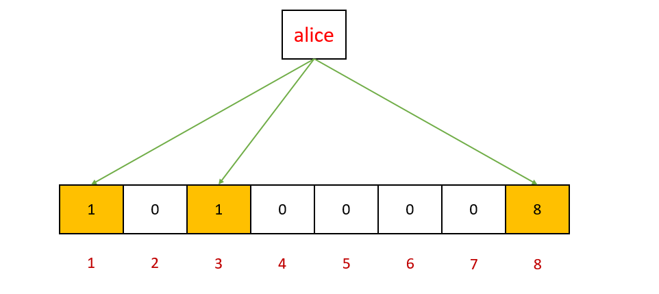
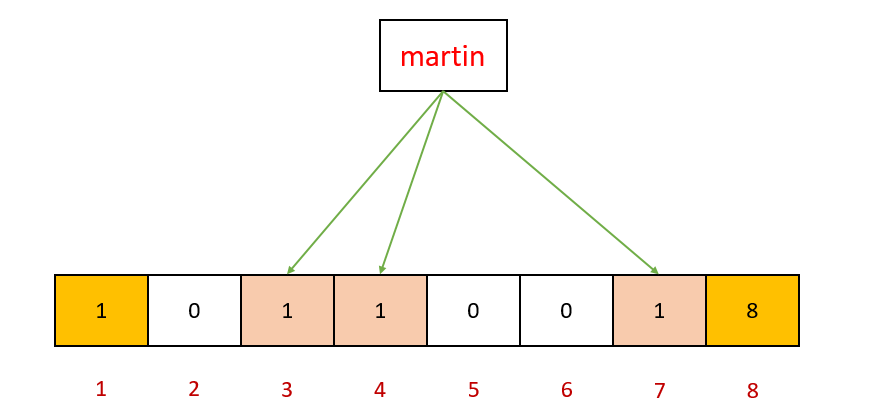

### 布隆过滤器的原理
　　Bloom Filter 是一个占用空间很小、效率很高的概率型数据结构，它由一个 bit 数组和一组 Hash 算法构成。可用于判断一个元素是否在一个集合中，查询效率很高（1-N，最优能逼近于1）。 
　　它是将所有地址经过多个 Hash 算法，映射到一个 bit 数组。

- 布隆过滤器是一个 bit 向量或者说 bit 数组；

- 对一个值使用多个不同的哈希函数，生成多个哈希值，并对每个生成的哈希值指向的 bit 位置 1。假如有三个哈希函数，值为 "alice"，这三个不同的哈希函数生成的哈希值为  1、3、8；

- 以此类推，一个新的值 "martin"，生成的哈希值为 3、4、7；

- 注意，这里 "alice" 的哈希值为 1、3、8，而 "martin" 的值为 3、4、7，3 的 bit 位被覆盖了。随着存入的值越多，越来越多的 bit 位都为 1，存在某个值没有存储，但该值的三个哈希值被置为 1，导致误判为已经存在。但如果某个值的三个哈希值都不是全部为 1，则肯定不存在；
- 布隆过滤器不支持删除操作，即将某个 bit 位置为0，因为一个 bit 位可能被多个的值的不同的哈希函数覆盖过（即多次置为1）。如果要删除，则使用计数删除。即删除一个值，对应的 bit 位则减一，添加一个值，对应的 bit 位则加一。

　　用布隆过滤器查值时，如果多个哈希函数返回的 bit 位 为 1，则该值可能存在。否则，该值一定不存在。与 Hash 比较：
  
- java 中的 HashMap 的负载因子默认是 0.75，即存 75 个数，至少需要一个 100 的数组，而且还会有不少的冲突。实际上，Hash 的存储效率是 0.5 左右，存 5 个数需要 10 个的空间；
- 而布隆过滤器不用为每个数都分配空间了，而是直接把所有的数通过算法映射到同一个数组，一般需要的空间仅为 HashMap 的 1/8-1/4 之间；

### 适用场景
　　优点是快速、省空间。

- 适合于快速判断一个元素是否在一个集合中，并且这个集合非常大，内存装不下（无法使用 HashSet、HashMap）；
- 能容忍一定的误识别率，可建立一个小的白名单，存储误识别的信息（比如被误判为垃圾邮件）；

### 实际应用场景：

- 网页爬虫对 URL 的去重，避免爬取相同的 URL 地址；
- 反垃圾邮件，从数十亿个垃圾邮件列表中判断某邮箱是否垃圾邮箱（同理，垃圾短信）；
- 缓存穿透，将已存在的缓存放到布隆中，当黑客访问不存在的缓存时迅速返回避免缓存及DB挂掉。

#### 缓存穿透
　　缓存穿透是指查询一个一定不存在的数据，由于缓存是不命中时被动写的，当查询不存在数据时，由于从存储层查不到该数据无法写入缓存中，导致每次数据请求都要从存储层去查询。在大流量的情况下，可能会导致数据库挂掉。还有可能被人利用，是用不存在的 key 来查找。 
　　解决缓存穿透的，最常见方法是使用布隆过滤器。 将所有可能存在的数据哈希到一个足够大的 bitmap 中，由于布隆过滤器的特性，不存在的数据会被这个 bitmap 拦截，从而避免对底层存储系统的查询压力。另外一种方法，是缓存这个空结果，将过期时间设置非常短且随机，随机是为了保证不要一起过期，防止出现大量的 key 请求去数据库查询。 
　　利用布隆过滤器减少减少磁盘 IO 或者网络请求，因为一旦一个值必定不存在的话，就可以不用进行后续的查询请求。

### 总结
　　布隆过滤器的背后的数学原理在于两个完全随机的数字相冲突的概率很小。因此，可以在很小的误识别率条件下，用很少的空间存储大量信息。误判率越低，则底层维护的数组越长，占用空间越大。因此，误判率实际取值，根据服务器所能够承受的负载来决定。

### Reference

- [维基百科-布隆过滤器](https://www.wikiwand.com/zh-hant/%E5%B8%83%E9%9A%86%E8%BF%87%E6%BB%A4%E5%99%A8)
- [使用 BloomFilter 布隆过滤器解决缓存击穿、垃圾邮件识别、集合判重](https://blog.csdn.net/tianyaleixiaowu/article/details/74721877)
- [详解布隆过滤器的原理，使用场景和注意事项](https://zhuanlan.zhihu.com/p/43263751)
- 《数学之美》
